# iTunes Clone

## Table of contents
* [Video Link](#video-link)
* [Description](#description)
* [Features](#Features)
* [Screenshots](#screenshots)
* [Architecture](#architecture)
* [Contact](#contact)

## Video Link

[iTunes Clone](https://www.linkedin.com/feed/update/urn:li:activity:7203093021125447682/)

## Description

Welcome to the iTunes Clone app created using SwiftUI and Combine. It contains a Networking Layer to fetch data from the Apple API to fetch songs, albums, and movies. 
Exploring the power of the Combine framework to manage data streams within ViewModels, for real-time updates and UI synchronization.
Getting hands-on experience while building the UI with SwiftUI using composable UI elements, to create layouts and interactions that engage users.
I've implemented infinite scrolling with pagination, mastering the management of large datasets while ensuring a smooth browsing experience for users. 
Building comprehensive state handling mechanisms to provide clear feedback during the data fetching process. Implementing error handling to gracefully manage unexpected errors and edge cases to strengthen the app's stability under various scenarios. 
The user is also able to navigate to iTunes using Safari to purchase a specific song, album, or movie that he wants from the app. I extend the invitation to all iOS developers to check the code and I am open for suggestions and improvements.

## Features

### 1. Implement a Networking Layer to fetch data from API:

- Efficiently fetch data from the Apple API using a robust Networking Layer, ensuring seamless communication between the iTunes app and the API, guaranteeing reliability and speed in data retrieval.

### 2. Use Combine to handle data stream in ViewModels:

- Leverage the power of Combine framework to elegantly manage and process data streams within ViewModels, facilitating reactive programming paradigms and enabling real-time updates and synchronization with the user interface.

### 3. Use SwiftUI to create UI in a composable way:

- Create a dynamic and responsive user interface with SwiftUI, embracing its declarative syntax and composable nature to design intuitive and visually appealing layouts to enhance user engagement and interaction.

### 4. Implement infinite scrolling with pagination:

- Enhance user experience by seamlessly loading additional content through infinite scrolling with pagination, ensuring a fluid browsing experience while efficiently managing large datasets without overwhelming the user.

### 5. Implement state handling for loading, error, and finished loading:

- Implementing comprehensive state handling mechanisms for loading, error, and completion states, to provide a clear feedback to users throughout the data fetching process.

### 6. Implement Error handling:

- Prioritize user satisfaction and app reliability by implementing error handling mechanisms, gracefully managing unexpected errors and edge cases to maintain app stability under various use-cases.

### 7. Navigate to iTunes using Safari to purchase songs, albums or movies:

- The user is also able to navigate to iTunes using Safari to purchase a specific song, album or movie that he wants from the app.

## Screenshots

Search Placeholder         |  Search Term All Section
:-------------------------:|:-------------------------:
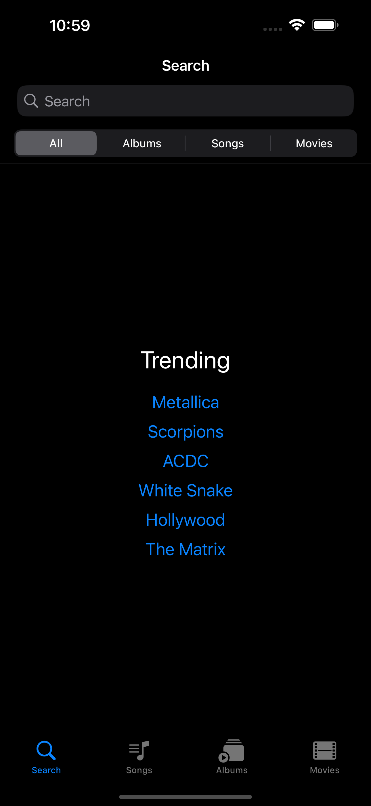 | 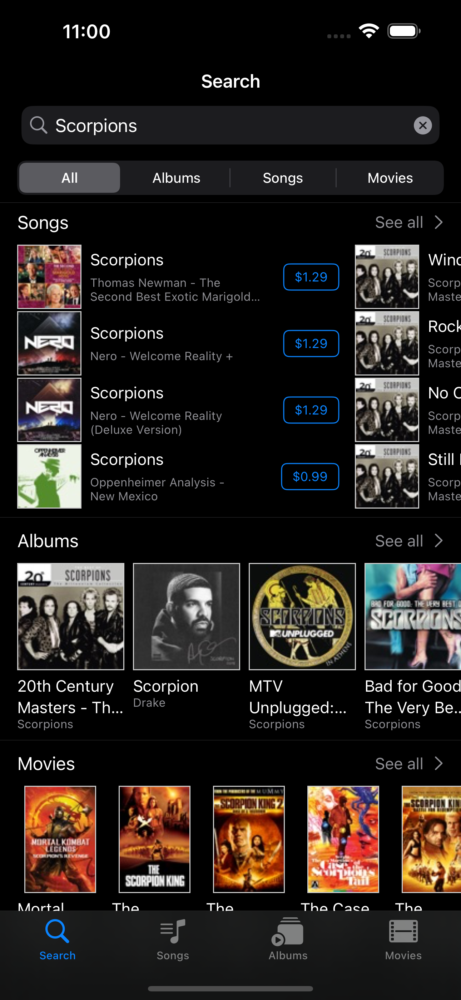

Search Term Album Section  |  Search Term Song Section
:-------------------------:|:-------------------------:
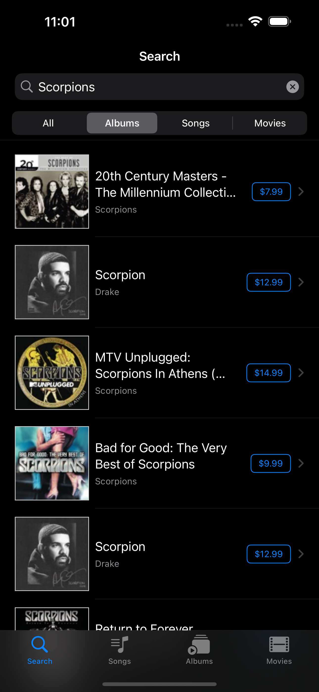 | 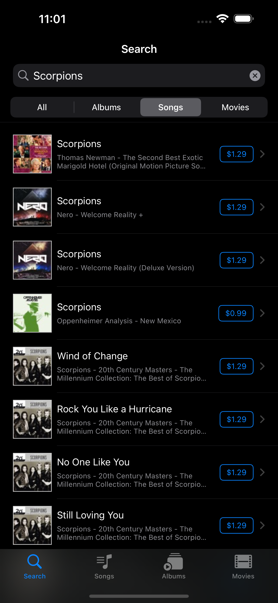

Search Term Movie Section  | Song Tab Screen
:-------------------------:| :-------------------------:
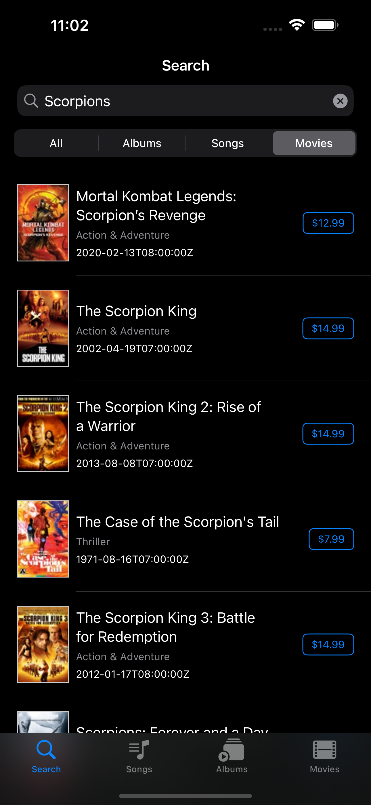 | 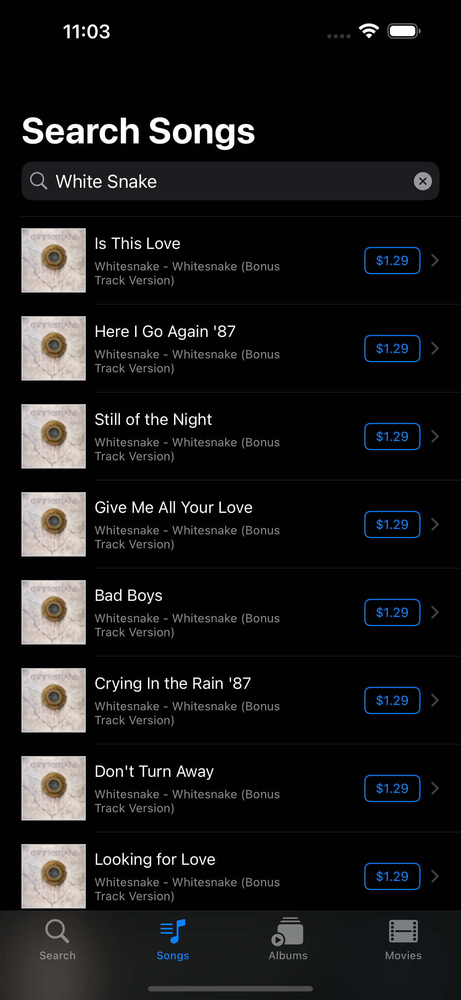

Song Detail Screen         | Albums Tab Screen
:-------------------------:| :-------------------------:
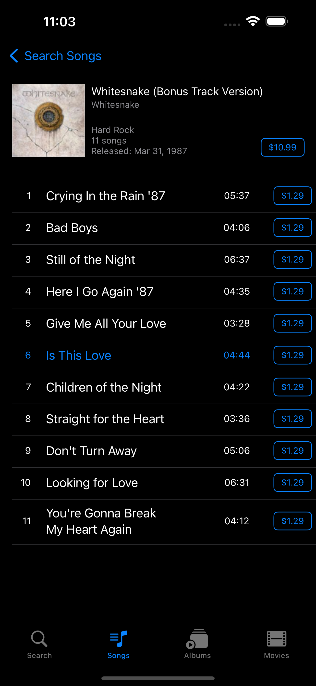 | 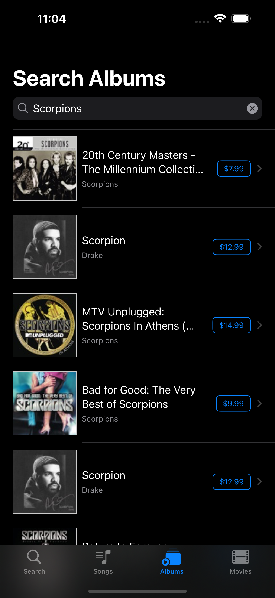

 Album Detail Screen       | Movies Tab Screen
:-------------------------:| :-------------------------:
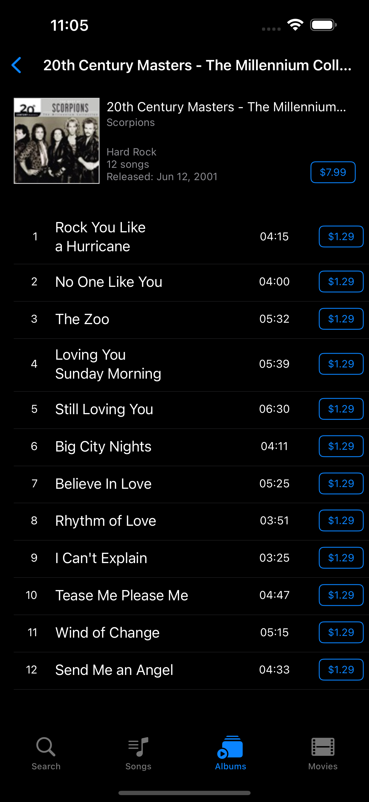 | 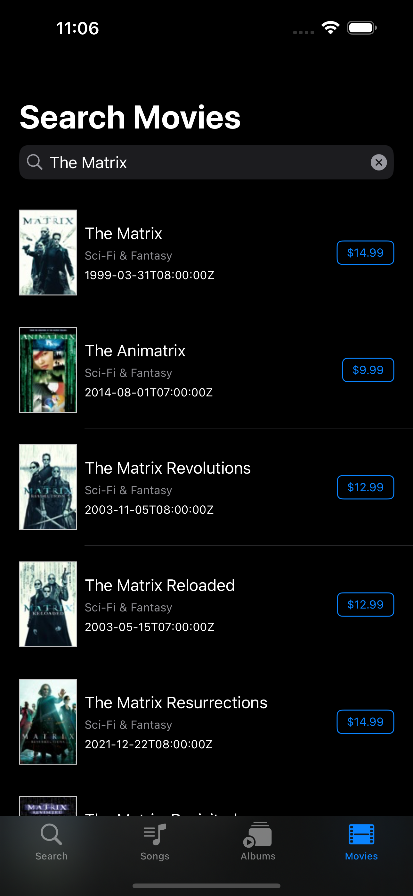

 Song Safari Screen        | Album Safari Screen
:-------------------------:| :-------------------------:
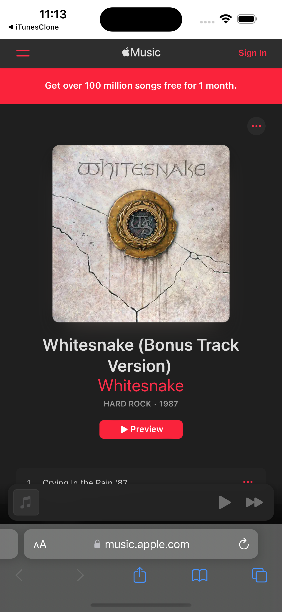 | 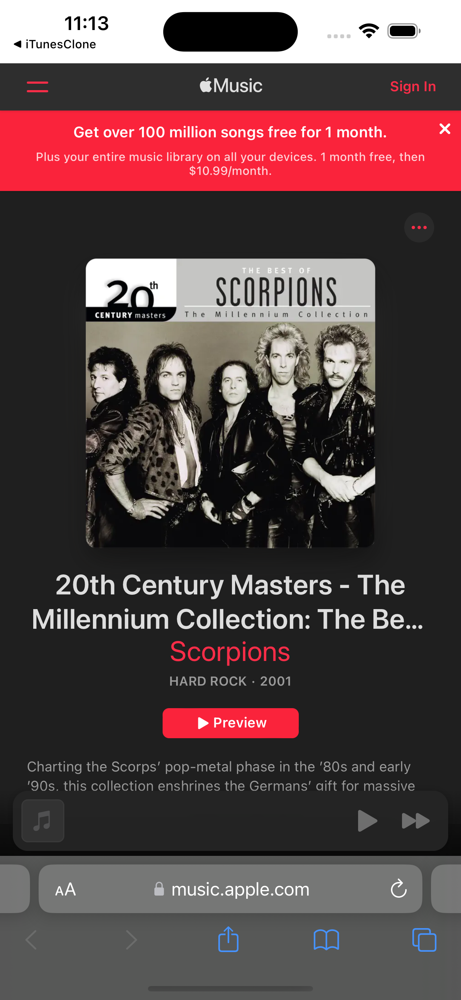

## Architecture

### MVVM

#### Model:

- The Model layer is responsible for representing the data from our business logic.

#### View:

- The View layer is responsible for handling all the layouts and displaying the data user-friendly. 
- The View knows the ViewModel but doesn't know the model.

#### ViewModel:

- The ViewModel layer is responsible for transforming the data received in a View-representative way, receiving actions from the View, and dealing with our business logic.
- The ViewModel Knows the Model layer but doesn’t know the View layer.
- It contains data binding that tells whoever is listening about those changes using the Combine framework. 

## Contact
Kevin Topollaj, email: kevintopollaj@gmail.com - feel free to contact me!
